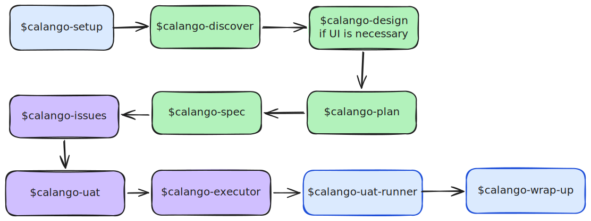
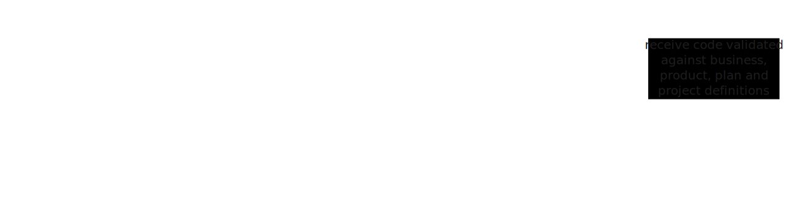

# Candango Skills

[](https://skills.sh/lucasbayma/skills)

Candango is a set of skills for taking a feature from repo setup to UAT, with planning, vertical issues, autonomous execution, independent validation, and wrap-up.

Candango depends on selected skills from [`mattpocock/skills`](https://github.com/mattpocock/skills) instead of copying them. Candango adds repo-local paths, feature docs, UAT flow, dashboards, and autonomous execution conventions.

## Usage

### Install Matt Skills First

Install the upstream skills that Candango wrappers call:

```bash
npx skills@latest add mattpocock/skills
```

Select these Matt skills:

- `caveman`
- `grill-with-docs`
- `to-prd`
- `to-issues`
- `tdd`

Candango uses them directly:

| Candango skill | Matt skill |
| --- | --- |
| `candango-discover` | `grill-with-docs` |
| `candango-plan` | `to-prd` |
| `candango-issues` | `to-issues` |
| `candango-executor` | `tdd` |

### Install Candango

Install with `skills.sh`:

```bash
npx skills@latest add lucasbayma/skills
```

Select the recommended set:

- `candango-setup`
- `candango-discover`
- `candango-design`
- `candango-plan`
- `candango-issues`
- `candango-uat`
- `candango-executor`
- `candango-uat-runner`
- `check-pr-comments`
- `candango-wrap-up`

Run setup once in each target repo:

```text
Use $candango-setup to configure this repo for autonomous feature delivery.
```

## Quickstart

Use the full flow when you want to deliver a feature end to end:

```text
Use $candango-discover to clarify this feature:

<feature request>

Then use $candango-plan, $candango-issues, $candango-uat,
$candango-executor, $candango-uat-runner, and $candango-wrap-up.
All communication and reports must use $caveman.
```

For a small feature that is already clear:

```text
Use $candango-plan to plan this small feature:

<feature request>

Then use $candango-issues, $candango-uat, and $candango-executor.
```

If the feature includes screens, flows, dashboards, apps, forms, or any visual surface, run `candango-design` before finalizing the plan and issues:

```text
Use $candango-design to locate the design system and coordinate UI work for this feature.
Target surface: <existing codebase | Figma | screenshots | local design artifacts>.
```

## Full Loop

### Development Cycle



### Executor Cycle



The key point: the executor that implements the work does not validate its own work. It writes code with Matt Pocock's `$tdd`; another subagent, without the executor's conversation context and without permission to edit, reviews the diff against the issue, plan, and UAT. If validation fails, the main agent turns the report into another TDD round. Manual UAT and final repo validation happen only after that.

## Feature Folder

All candango-specific docs and HTML live together:

`docs/features/<feature-slug>/`

Default contents:

- `context.md`
- `plan.md`
- `uat.md`
- `issues.md`
- `index.html` execution dashboard
- `state.json` execution state
- `design/` local UI/design artifacts

`index.html` and `state.json` are runtime dashboard files. `$candango-wrap-up` removes them before PR when they are not needed.

## Communication Contract

All user-facing communication and written reports must use `$caveman`.

This includes:

- planning summaries
- clarification questions
- issue breakdown reports
- UAT reports
- UAT run confirmations
- executor reports
- validator reports
- dashboard history
- final completion reports
- PR descriptions

## Skills

### [`candango-setup`](./skills/candango/candango-setup/SKILL.md)

Configures the repo for the Candango flow. It discovers or asks which tracker to use, where feature docs live, which command validates the work, where to save the dashboard, how to handle design artifacts, and which rules agents must follow.

It creates local documentation so the other skills do not depend on conversation memory. Run it once per repo, and run it again only when changing tracker, docs convention, or validation process.

### [`candango-discover`](./skills/candango/candango-discover/SKILL.md)

Calls Matt Pocock's `grill-with-docs` with Candango's feature context target: `docs/features/<feature-slug>/context.md`.

Use it to resolve ambiguous terms, business rules, actors, permissions, happy paths, errors, contracts, UX, rollout, UAT, slicing, final validation, and autonomous-execution readiness.

### [`candango-design`](./skills/candango/candango-design/SKILL.md)

Runs when the feature has an interface: web screen, app, dashboard, admin panel, onboarding, checkout, settings, form, table, flow, or visual change. It locates the design system, coordinates UI work, and makes sure design artifacts are available before the plan and issues are finalized.

### [`candango-plan`](./skills/candango/candango-plan/SKILL.md)

Calls Matt Pocock's `to-prd` with Candango's feature context as input and writes the plan target: `docs/features/<feature-slug>/plan.md`.

### [`candango-issues`](./skills/candango/candango-issues/SKILL.md)

Calls Matt Pocock's `to-issues`, confirms the tracker, converts each generated issue to Candango's issue template, and stores the local issue index at `docs/features/<feature-slug>/issues.md`.

Before writing or publishing issues, it shows the proposed breakdown and waits for approval.

### [`candango-uat`](./skills/candango/candango-uat/SKILL.md)

Generates acceptance scenarios from business rules, the plan, issues, feature context, and design artifacts. The focus is external behavior, not internal detail.

UATs use Given/When/Then, have priority, indicate whether they are automated, manual, or both, and point to which acceptance criteria they prove. During execution, the validator uses these UATs as the business oracle.

### [`candango-executor`](./skills/candango/candango-executor/SKILL.md)

Orchestrates autonomous execution. The main agent picks unblocked issues, updates the dashboard, starts an executor with Matt Pocock's `$tdd`, starts an independent validator, decides whether to return to fixes, UAT, or done, rechecks backlog whenever an issue transitions to `done`, starts newly unblocked issues, and runs final validation.

The executor may edit code. The validator does not edit; it receives the diff, issue, plan, and UAT, but not the executor conversation. This forces external validation instead of self-approval.

### [`candango-uat-runner`](./skills/candango/candango-uat-runner/SKILL.md)

Runs manual or semi-automated UAT after implementation. It guides one scenario at a time, runs automated checks when possible, gives clear manual steps to the user, and records passed, failed, or blocked status.

When a UAT fails, it captures repro steps, expected behavior, actual behavior, evidence, and related context, then sends that package to `candango-executor` to restart the fix loop with TDD and validation.

### [`check-pr-comments`](./skills/utils/check-pr-comments/SKILL.md)

Triages pull request feedback from a single polling window. It gathers PR comments, review summaries, inline comments, and review threads; groups related feedback; and presents each actionable item with two or three fix or reply options.

It waits for user direction before editing code, posting replies, resolving threads, or changing PR state.

### [`candango-wrap-up`](./skills/candango/candango-wrap-up/SKILL.md)

Finalizes the feature. It removes temporary dashboard files, verifies tests and final validation, checks UAT status, classifies the PR as feat, bugfix, or chore, prepares the commit, and creates the PR.

The PR should make clear what changed, why it changed, which UATs passed or remain pending, which commands validated the work, and whether temporary files were cleaned up.

### [`fix-pr-checks`](./skills/utils/fix-pr-checks/SKILL.md)

Monitors GitHub PR checks every 60 seconds, diagnoses failing checks, applies focused fixes, and reports each poll in Caveman-style tables.

Use it when a PR needs active check polling, failure repair, and compact status reporting until checks pass or a blocker appears.

## References and Credits

Candango combines original flow with skills and patterns used as a base:

- [`mattpocock/skills`](https://github.com/mattpocock/skills): the main reference for small composable skills, disciplined TDD, strong questions before implementation, local domain docs, vertical issues, and concise communication.
- [`grill-with-docs`](https://github.com/mattpocock/skills/tree/main/skills/engineering/grill-with-docs), by Matt Pocock: the base for stress-testing requirements against docs, ADRs, and domain language.
- [`to-prd`](https://github.com/mattpocock/skills), by Matt Pocock: the base for feature planning.
- [`to-issues`](https://github.com/mattpocock/skills), by Matt Pocock: the base for issue slicing.
- [`tdd`](https://github.com/mattpocock/skills/tree/main/skills/engineering/tdd), by Matt Pocock: the base for the behavior-oriented RED/GREEN/REFACTOR cycle.

The rest of the Candango skills connect these pieces into a full cycle: repo setup, clarification, optional design, plan, issues, UAT, autonomous execution, independent validation, guided UAT, and wrap-up.
